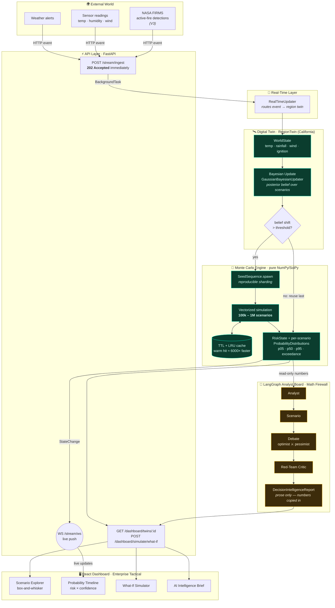
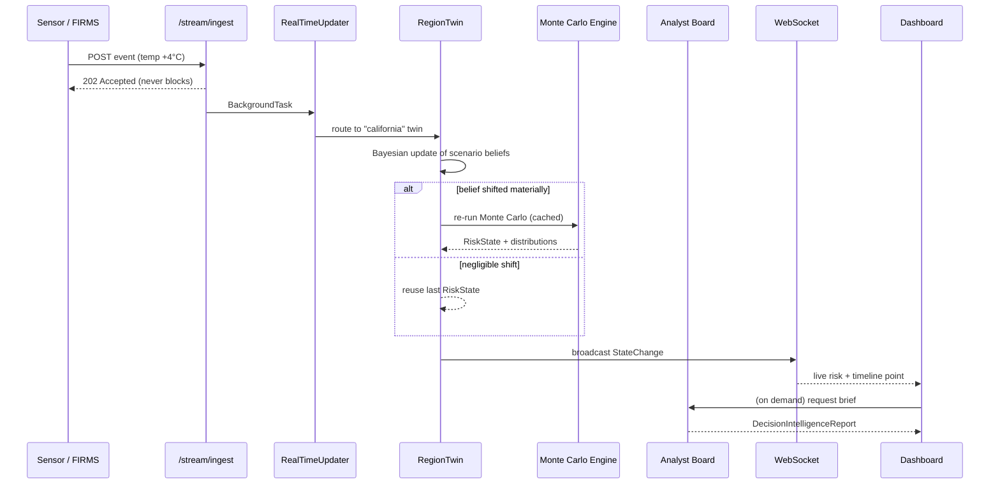

# VECTIS V2 — System Architecture

VECTIS V2 is a **real-time probabilistic decision-intelligence platform**. It turns
a stream of real-world observations into *distributions over possible futures* —
not single point predictions — and narrates them with an auditable AI board whose
numbers are produced entirely by deterministic math.

This document maps the end-to-end flow and ties each stage to the code that
implements it.

---

## The end-to-end flow

**The Golden Rule (Math Firewall).** Everything in green is deterministic
`numpy`/`scipy` — no LLM ever touches a number. Everything in amber is the LLM
board, which only *reads* the engine's output and writes prose. The boundary is
enforced structurally: nothing under `simulation/` imports `vectis.agents`, and
every numeric field on `DecisionIntelligenceReport` is copied from `BoardInput`
(the engine's verdict), never generated.

---

## What happens when an observation arrives

The ingest path returns **202 immediately** and hands the CPU-bound math to a
background worker thread — ingestion is never blocked by computation. A re-run only
happens when the posterior belief moves past a threshold; otherwise the last
`RiskState` is reused (and the cache makes even a forced re-run on an unchanged
state near-instant).

---

## Component → code map

| Stage | Responsibility | Code |
| --- | --- | --- |
| Ingest / stream | Async accept, route, broadcast | `vectis/api/routers/stream.py`, `vectis/streaming/` |
| Real-time updater | Event → twin routing | `vectis/streaming/updater.py` |
| Digital twin | State + belief, re-run policy | `vectis/digital_twin/entities/region.py` |
| Bayesian update | Posterior over scenarios | `vectis/simulation/probability/bayesian.py` |
| Monte Carlo engine | Vectorized 100k–1M scenarios | `vectis/simulation/engine/runner.py` |
| Caching | TTL + LRU memoization | `vectis/simulation/caching.py` |
| Distributed (stub) | Ray/Dask abstraction | `vectis/simulation/engine/distributed.py` |
| Analyst board | LangGraph narration | `vectis/agents/board/` |
| Dashboard API | View-models for the UI | `vectis/services/dashboard_service.py`, `vectis/api/routers/dashboard.py` |
| React dashboard | Visualization | `frontend/src/pages/DashboardPage.tsx`, `frontend/src/features/dashboard/` |

---

## Reproducibility & scale (Session 13)

The engine is reproducible per `(seed, n_workers)`: draws are sharded with
`numpy.random.SeedSequence.spawn`, so serial, multiprocessing, and the distributed
stub all produce **byte-identical** results. On a 12-core dev machine a 1,000,000 ×
3-branch run (3M trajectory evaluations) completes in **~0.8 s single-thread** at
~72 MB peak — see `docs/v2_simulation_engine.md` §10 and `make stress`. For this
cheap vectorized math, multiprocessing is *slower* (process spawn + pickling cost
more than the compute), so it stays off by default — documented honestly rather
than hidden.
