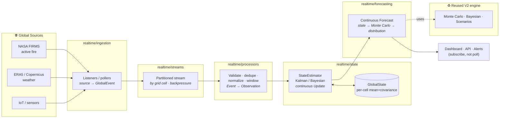

# VECTIS V3 — Real-Time Intelligence Architecture (Blueprint)

> **Status:** design blueprint (Session 16). No stream processors, Kafka, or
> WebSocket integrations are implemented yet — this document defines the concepts,
> the data flow, and the interface contracts the V3 layer will be built against.

---

## The paradigm shift: V2 → V3

| | **V2 — Possible Worlds** | **V3 — Living System** |
|---|---|---|
| Scope | One region (Liguria) | **The whole world** (a global geospatial grid) |
| Trigger | Discrete events posted to an endpoint | **Continuous streams** from external APIs |
| State | One `RegionTwin` in memory | A **continuously-estimated global state** across many cells |
| Update | On-demand, per ingested event | **Always-on** Bayesian/Kalman filtering of the live stream |
| Output | A risk picture when asked | A **continuous forecast** that is always current |

V2 answered *"given this state, what are the possible futures?"*. V3 keeps that
engine but wraps it in a system that **never stops observing the world**: it ingests
thousands of events per minute from live sources, continuously re-estimates the
state of every cell on a global grid, and keeps every forecast current without anyone
pressing a button.

V3 is a **generalization, not a rewrite**. The V2 Monte Carlo engine, Bayesian
updater, and scenario machinery are reused unchanged behind the same interfaces; V3
adds the *continuous, global, streaming* layer in front of them.

---

## Core concepts (the V3 vocabulary)

These six terms are the contract every V3 module is written against. Each is a
distinct stage with a distinct type, so the pipeline is composable and testable.

1. **Event** — *raw* data as it leaves an external source. Untrusted, unnormalized,
   high-volume (e.g. one NASA FIRMS active-fire row, one ERA5 grid reading). Modeled
   by `GlobalEvent` in `realtime/events/`. An Event carries **where** (geospatial
   coordinates / grid cell), **when** (source + ingest timestamps), and **what** (a
   raw payload), but makes no claim about correctness.

2. **Stream** — the *continuous flow pipeline* that carries Events from sources to
   processors. It owns transport concerns the engine must never see: partitioning by
   grid cell, ordering, **backpressure**, batching/windowing, and at-least-once
   delivery. Modeled in `realtime/streams/`. Today an in-process abstraction; later a
   Kafka topic set — callers don't change.

3. **State** — the system's *continuous, persisted belief about the world*: for each
   active grid cell, the current estimate of its physical variables **and the
   uncertainty around them** (mean + covariance). This is the living thing V3
   maintains. Modeled in `realtime/state/`. It is global, sparse (only cells with
   data are tracked), and always reflects the latest processed Observation.

4. **Observation** — an Event after a `processor` has **validated, deduplicated, and
   normalized** it into the exact shape the estimator/engine consume (the V2
   `Observation` concept, lifted to global scope with geo + provenance). The clean
   boundary between *transport* (Event/Stream) and *math* (Observation/State).

5. **Update** — the *adjustment step*: folding one Observation (or a batch) into the
   State via a **Kalman filter** (for continuous-valued variables with Gaussian
   noise) or **Bayesian update** (for the discrete scenario beliefs). This is where
   `realtime/state/StateEstimator` does its work — incrementally, never recomputing
   from scratch.

6. **Forecast** — the *continuous prediction output*. Because the State is always
   current, the Forecast is too: at any moment V3 can project each cell's state
   forward through the Monte Carlo engine to a distribution over outcomes. Modeled in
   `realtime/forecasting/`. Consumers (dashboard, API, alerts) subscribe to forecasts
   rather than requesting them.

```
 Event ──▶ Stream ──▶ [Processor] ──▶ Observation ──▶ [Update] ──▶ State ──▶ Forecast
 (raw)    (flow)      validate/         (clean)        Kalman/      (living)   (continuous
                      dedupe/normalize                 Bayesian                 prediction)
```

---

## End-to-end data flow



---

## Designing for scale (the quality-check answers)

V3 must absorb **thousands of events per minute** without bottlenecking. The
blueprint bakes that in at the interface level:

- **Decouple ingestion from computation.** Listeners only parse and enqueue
  (`Event → Stream`); they never block on the estimator. This is the V2 "202 Accepted
  + background work" principle, generalized to a durable stream. A slow estimator
  applies backpressure to the stream, never to the source listener.
- **Partition by grid cell.** The global grid is the natural shard key: cell *X*'s
  Updates are independent of cell *Y*'s, so processing scales horizontally by
  partition (Kafka partitions / worker pool) with no cross-cell locking. The V2
  per-twin-lock lesson, at planetary scale.
- **Batch + window, don't update per-event.** Processors coalesce bursts per cell
  into time/size windows, so the estimator does one Update per window instead of one
  per event — turning thousands of events/min into a bounded Update rate.
- **Incremental Updates, O(1) per step.** A Kalman filter folds each Observation into
  the existing State in constant time — no replay, no full recompute. State size is
  *active cells*, not *event history*.
- **Sparse, bounded State.** Only cells with recent data are held in memory; stale
  cells age out to the persisted store (see `v3_state_management.md`). Memory is a
  function of *activity*, not of the size of the globe.
- **Interfaces are async-ready and transport-agnostic.** The contracts are written so
  the in-process stub and a Kafka/async implementation are drop-in swaps — the
  estimator and engine never know which is behind the Stream.

> **Why streams, not requests:** at global scale, "ask for the risk of cell X" is the
> wrong shape — there are millions of cells changing constantly. V3 inverts it: the
> State is continuously maintained, and consumers **subscribe** to the forecasts they
> care about. Computation happens once, on update, not once per reader request.

---

## Module map

| Subpackage | Responsibility | Concept owned |
|---|---|---|
| `realtime/ingestion/` | Source listeners/pollers → raw events | Event (emit) |
| `realtime/events/` | Global event + observation schemas | Event |
| `realtime/streams/` | Continuous flow, partition, backpressure | Stream |
| `realtime/processors/` | Validate/dedupe/normalize/window | Event → Observation |
| `realtime/state/` | Continuous global estimation (Kalman/Bayes) | State + Update |
| `realtime/forecasting/` | Continuous prediction output | Forecast |

Detailed State design: **[`v3_state_management.md`](v3_state_management.md)**.
Reused engine internals: **[`v2_simulation_engine.md`](v2_simulation_engine.md)**.
